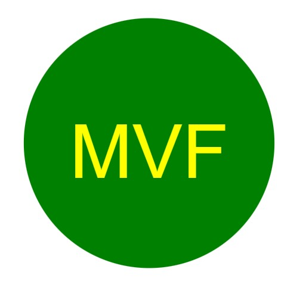

# Module-10-Challenge (Logo-Generator)
## Description
This is the 10th assignment or challenge for our bootcamp class. In this assignment we're tasked to create an SVG logo maker using Node.js command-line application that takes user input. The application prompts user to select a color, shape, text and text color for the logo and saves the generated SVG to a `.svg` file.

The application will be invoked by using the following command:

```
node index.js
```
Below are the sample logo created:




## Installation
Inquirer and jest package must be installed by entering below in the command line:

```
npm i inquirer @8.2.5
npm i jest
```

## Usage
Given the command-line application that accepts user input, user will be prompted to enter the logo text which will only accept a maximum of 3 characters, then will receive prompt to enter the text color, shape of the logo - user have 3 option (circle, square and triangle) then finally the background color. After user inputs all information, they will receive a message that logo.svg is generated.

To run the test:

```
npm run test
```

URL of Github repository : https://github.com/mvfranzke/Logo-Generator

Video Link (user flow): 

## Credits
I've used the following in completing this project:

- https://www.npmjs.com/package/inquirer#reactive
- https://coding-boot-camp.github.io/full-stack/github/professional-readme-guide
- https://coding-boot-camp.github.io/full-stack/computer-literacy/video-submission-guide

Youtube Tutorials:
- https://youtu.be/P3aKRdUyr0s
- https://www.youtube.com/watch?v=PGAGcePjbPA


## License
N/A
